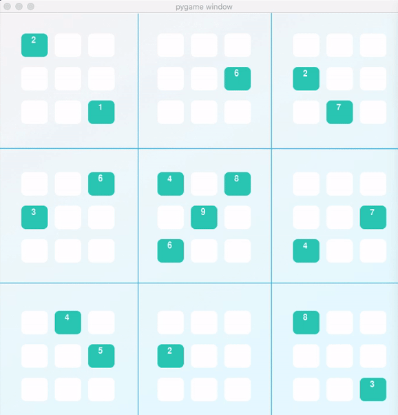

# Solve Sudoku with AI

Developed a sudoku solving agent using constraint satisfaction strategy, and further extended it to solve diagonal sudoku puzzles. A diagonal sudoku puzzle is identical to traditional sudoku puzzles with the added constraint that the boxes on the two main diagonals of the board must also contain the digits 1-9 in each cell.

'solutions.py' contains main meat of this solution
